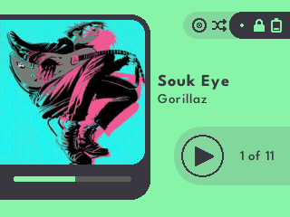
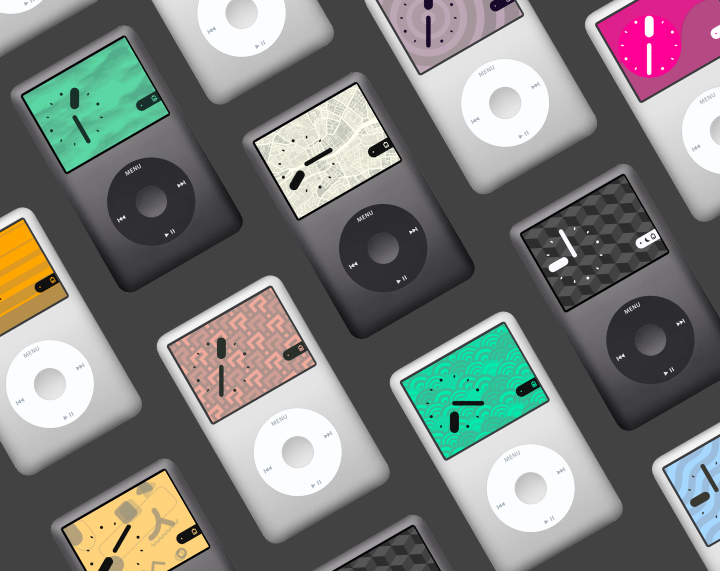

# Themify

Themify is an advanced, user-customisable theme for Rockbox. Every on-screen element can be customised using Rockbox's built in background and foreground colour settings. The theme features many adaptive elements, giving you a modern Rockbox experience like no other. This theme currently supports iPod Classic 5th, 6th and 7th generations.

## Extras

 - CJK Supporting fonts and larger fonts can be found in the **releases** section.  
 - Releases with settings for smooth scrolling text 
 - A pack of Extra Wallpapers seen below can be purchased [here](https://d00k.itch.io/themifywallpaperpack).

## Features

- Fully colour-customisable user interface. Background and Foreground colours can be set in the theme settings of Rockbox.
- Adaptive UI elements for player status icons to keep the interface clean and minimal. 
- Custom Lockscreen when the hold switch is on in the home screen. Lockscreen features a large analog clock and album art.
- Custom Quickscreen, with detailed battery status as well as sliders for brightness and volume.

For more information about the technical side of Themify, check out [this blog post](https://d00k.net/journal/inside_themify/).

## Experimental User Configs

Version 1.1 features an experimental user config feature for changing the behaviour of the Artist label in the player and miniplayer. This uses the unused "Status Bar" setting in rockbox to let users choose their preference of Album title + Artist, or either on their own as seen below

**Themify Player Secondary Info Line Config**: Settings > Theme Settings > Status-/ Scrollbar > Status Bar.

| Status Bar Value | Result in Player |
| ----------- | -----------|
| off | Artist Name only |
| top | Album Title only |
| bottom | Artist Name & Album Title cycled every 6 seconds |

## Themify 2 Dev Builds

An ambitious and technically challenging remake of Themify, Themify 2 will be the ultimate version of the customisable UI for Rockbox iPods. Due to the difficult nature of the goals, development is expected to take quite some time. For this reason, development builds will available over time for users to test and provide feedback on the user experience, bugs and report crashes to help aid in the completion of this project. Thanks to anyone who seeks to help.

[Download the latest Dev Build](https://github.com/D0-0K/themify/releases/tag/v.2.0-dev.2)

| Features | Current State |
| ----------- | -----------|
| Music Player | 90% Complete |
| Main Menus | 85% Complete |
| Lockscreen | 75% Complete |
| Status Bar | 100% Complete |
| Quickscreen | Un-implemented |
| Miniplayers | 90% Complete |
| Icon Set | 15% Complete |

## Project Plan

Version 2.0 of Themify will be a major update to move the theme towards a more mature state of completion. The main goal of the next update will be to anti-alias the entire UI, getting rid of the jagged edges. There's also some more features planned:

- Choosing between digital and analog clocks on the Lockscreen.
- Better Language support for dates, time etc.
- Better respect for rockbox settings for time.
- Custom UI screens for the User Configs, including adding more configs.
- Redesign the Quickscreen.

## Notes for Users

Minor flashes of UI elements are to be expected when using this theme. This is due to the logic needed to operate the Lockscreen feature. Please keep this in mind when using Themify.
