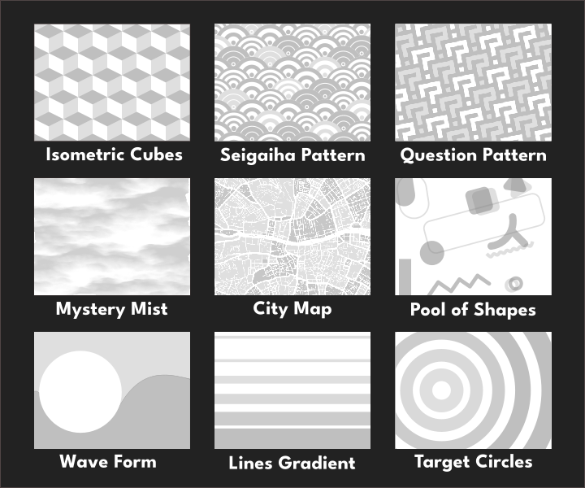

# Themify

Themify is an advanced, user-customisable theme for Rockbox. Every on-screen element can be customised using Rockbox's built in background and foreground colour settings. The theme features many adaptive elements, giving you a modern Rockbox experience like no other. This theme currently supports iPod Classic 5th, 6th and 7th generations.

## Extras

 - CJK Supporting fonts and larger fonts can be found in the **releases** section.  
 - Releases with settings for smooth scrolling text 
 - A pack of extra wallpapers seen below can be purchased [here]()
 
 <iframe src="https://itch.io/embed/1968733?linkback=true&amp;border_width=2" width="554" height="169" frameborder="0"><a href="https://d00k.itch.io/themifywallpaperpack">Themify - Wallpaper Pack by Dook</a></iframe>

## Features

- Fully colour-customisable user interface. Background and Foreground colours can be set in the theme settings of Rockbox.
- Adaptive UI elements for player status icons to keep the interface clean and minimal. 
- Custom Lockscreen when the hold switch is on in the home screen. Lockscreen features a large analog clock and album art.
- Custom Quickscreen, with detailed battery status as well as sliders for brightness and volume.

For more information about the technical side of Themify, check out [this blog post]().

## Notes for Users

Minor flashes of UI elements are to be expected when using this theme. This is due to the logic needed to operate the Lockscreen feature. Please keep this in mind when using Themify.
